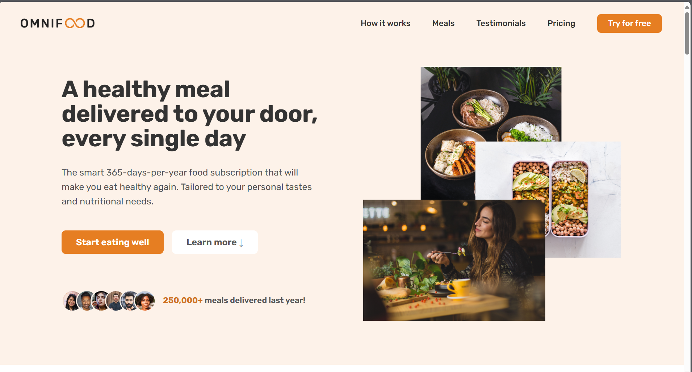

# 🍽️ Meal Planner Landing Page

This is a responsive landing page for a fictional meal subscription service, **Omnifood**. The page was built using **HTML** and **CSS**, focusing on layout structure, color harmony, accessibility, and responsive design.

## 📸 Preview

## 🚀 Features

- ✅ Fully responsive layout
- ✅ Clean and modern UI
- ✅ Accessible HTML structure
- ✅ Organized CSS files with BEM-style naming
- ✅ Proper use of color contrast and spacing
- ✅ Custom sections like testimonials, pricing, features, and call-to-action

## 🧱 Project Structure

meal-planner-landing-page/
├── css/
│ ├── general.css
│ ├── queries.css
│ └── style.css
├── img/
│ ├── app/
│ ├── customers/
│ ├── gallery/
│ ├── logos/
│ ├── meals/
│ ├── eating.jpg
│ ├── favicon.png
│ ├── hero.png
│ └── omnifood-logo.png
└── index.html

## 🛠️ Tech Stack

- HTML5
- CSS3 (Flexbox, Grid, Media Queries)

## 📱 Responsiveness

The layout adapts smoothly across devices:
- 📱 Mobile
- 💻 Tablet
- 🖥️ Desktop

## ♿ Accessibility

- Semantic HTML tags (`<section>`, `<header>`, `<nav>`, `<main>`, `<footer>`)
- Descriptive alt texts for images
- Color contrast optimized for readability

## 📌 Live Demo

## 📚 Inspiration

This project was inspired by a course project to practice responsive design and accessibility best practices.

---

